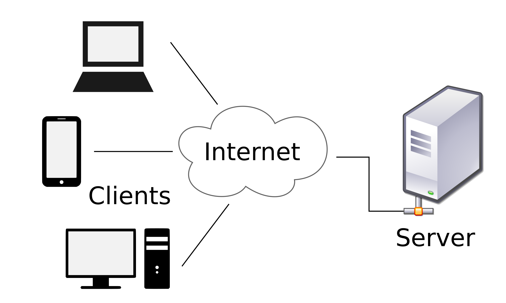
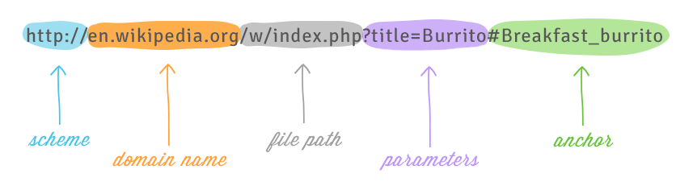

# Lesson 4 - Web API and JSON

In this lesson, we'll begin looking at Web APIs and how to use them. Almost all modern websites use web APIs to send data to your browser.

We'll also take a look at a data format called "JSON". Most (not all) APIs return data in a structured format called JSON, which is designed to be readable both for humans and for computers.

### 0. Client-Server Architecture

Client-Server architecture describes how applications talk to each other over the web.



Examples of clients: an Internet Browser (Chrome, Firefox, etc.), Slack, Python script, any others?

Servers are typically things we as consumers don't see. A server could be a computer in a remote datacenter, or it could even be a computer on your local network!

In client-server architecture, the client "asks" the server for data. It does this by giving the server a path to the resource it wants. What does this remind you of?

When someone goes to `google.com`, our browser (the client) is asking a Google server for all the HTML, CSS, Javascript, etc. that our it needs to render the Google website.

When a client asks for data from a server, we call that the `request`.

When the server gives data back to the client, we call that the `response`.

What do you think are advantages of client-server architecture?

### 1. What are Web APIs?

Web APIs are special interfaces that make it easy for applications to request data from a server. Most modern web applications use web APIs to send data from the "backend" (server) to the "frontend" (client).

Let's explore https://vaccinefinder.org/, and see if we can find out whether or not it's using a Web API.

### 2. Request Data from a Web API in Python

(You can do this in a new Jupyter notebook)

To do this, we are going to leverage a library called [`requests`](https://requests.readthedocs.io/en/master/).

You can install `requests` using `pip`.

Let's try making a request to fetch some data from the Vaccine finder Web API!

```
import requests

res = requests.get('...')

res.text
```

### 3. What is JSON?

Most Web APIs will return data in a format called JSON (another data format that is common is CSV).

JSON data is just plain text that is structured in a special way, and is designed to be human-readable.

JSON looks very similar to a Python dictionary. It is composed of an "Object" and "key-value" pairs.

This is a very simple JSON "Object":

```json
{
  "key": "value"
}
```

Keys must *always* be strings.

Values can be Strings, numbers, lists, or nested objects. Here's an example of each:

```json
{
  "string": "string",
  "number": 1.0,
  "list": [
    "string",
    2.0
  ],
  "object": {
    "nested": "string"
  }
}
```

*Note: JSON objects don't care about indentations or spaces. In order to save bandwidth and keep costs low, most Web APIs will omit all the extra spacing and indentation!*

### 4. Parsing JSON data in Python.

Once we receive a JSON response from the web server, we need to parse it to make it actually useful.

Python provides some [utilities to parse a JSON string](https://docs.python.org/3/library/json.html):

```
import json

data = json.loads(???)
```

### 5. Asking for Specific Data from a Web API

There are a couple of different ways we can tell a Web API what data we want (in the request).

First, we have to look at how a URL is constructed:



Web API's typically allow you to request specific pieces of data in the:

  1. URL *Path*
  2. URL *Parameters* (or *query string*). These are Key/Value pairs that are formatted in a special way.
  3. Request Body (we won't cover this today)

*Note: How you actually request data varies from API to API. You'll have to consult the API documentation on a case-by-case basis to learn which data you can access frmo an API.*

Let's look at the API documentation for VaccineFinder: https://api.findertools.org/api/swagger/

  1. Find the documentation for this *endpoint*: `/public/providers/{zipcode}`.
  2. Make a URL to request provider data for your zipcode, and try it out! (Pay attention to the `Base URL` listed at the top of the documentation page)
  3. Try adding a parameter called `format`, and setting the value to `json`. What do you notice?

### 6. Looking at the locations endpoint for VaccineFinder

The API documentation for VaccineFinder is not comprehensive. There are parameters that the API accepts that are not listed! Let's take a look at the request that VaccineFinder is making when you search for a location, and reverse engineering it!

### 7. Short Exercise (or Homework)

Add this to a new Jupyter notebook:

```python
import ipywidgets as w
import requests

zipcode_input = w.Text(
    value='',
    placeholder='',
    description='Zipcode:',
    disabled=False
)

def get_data_from_api(zipcode):
    if (len(zipcode) < 5):
        print('not valid')
    else:
        response = 0 # TODO: Get the provider data for the given zipcode, and print the JSON

        print(response)

w.interactive_output(get_data_from_api, { 'zipcode': zipcode_input })
```

You should see "not valid" show up.

Then render the text input, by running this in a new block:

```python
zipcode_input
```

Walk through the code, and try to understand what it's doing. Fill in the code for the `TODO`, and make the application get provider data from the VaccineFinder web API.

*Hint: Use the `/public/providers/{zipcode}` endpoint from earlier!*
